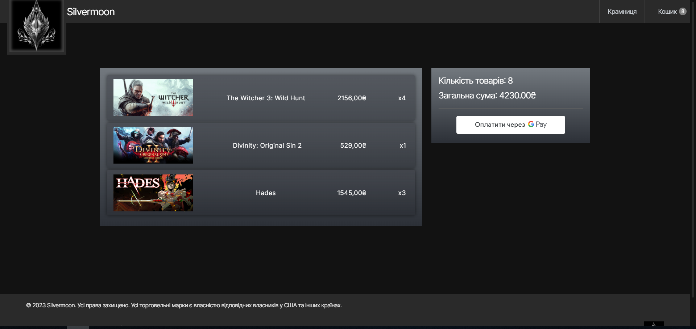

# Online computer game store
## Project Description
A project of the Silvermoon online role-playing computer game store. Its application allows customer users to browse the list of games available for purchase, filter and sort the available list of goods, as well as conveniently and quickly make purchases using the reliable Google Pay service. As a result of a successful transaction, the system sends an order receipt to the customer's email.

## Some screenshots with use case examples

 

